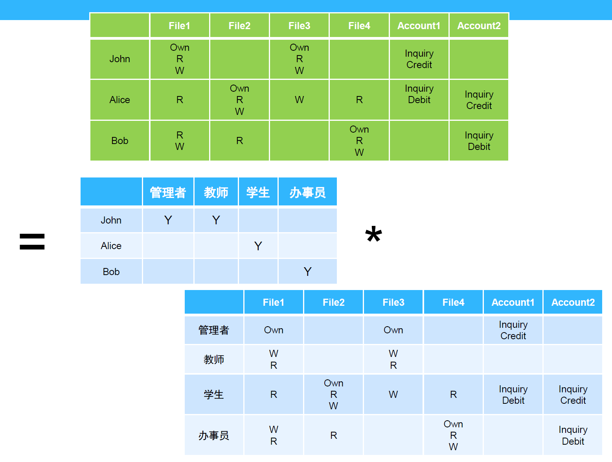
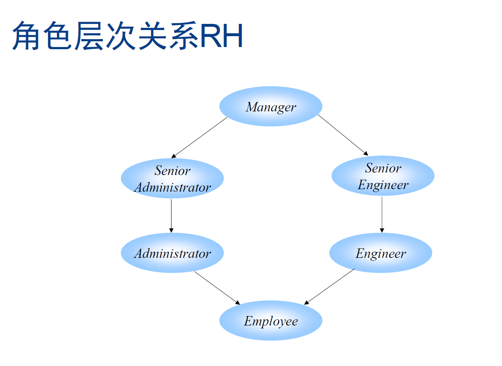
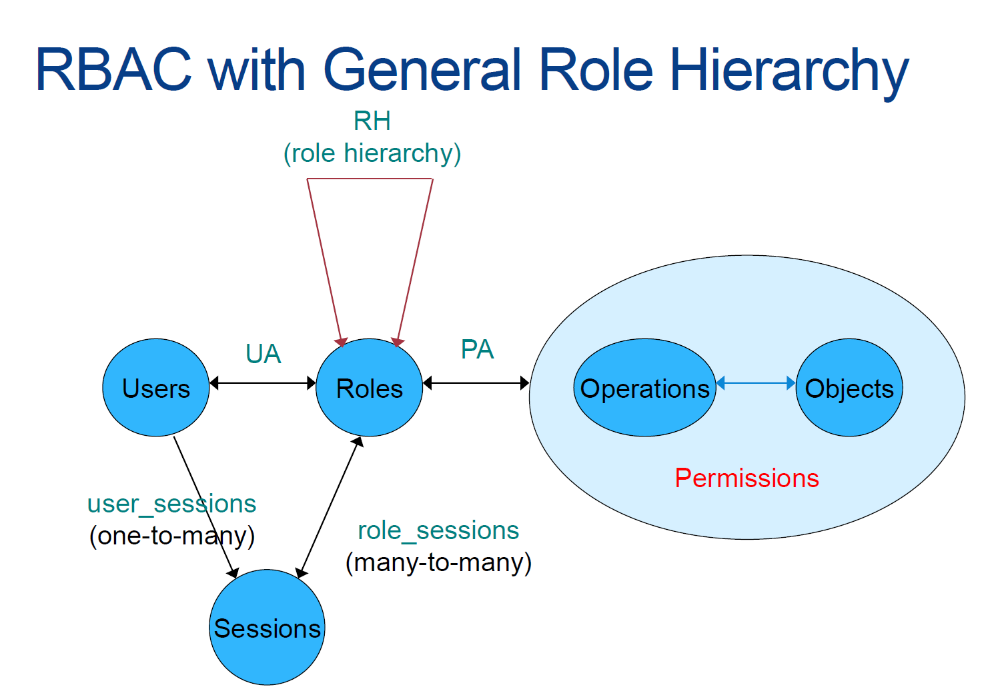
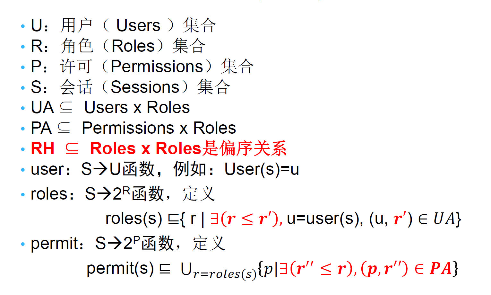

WisForm = 学院 + 问卷  
学院 = 项目 + 人员  


# 项目  
- 项目名  
- 人员 （项目节点-项目中的身份->人员节点 ）  
-   
- 经费  
- 类别 （国家项目 / 校企合作 / 论文 / ...）  
- 时间  

## 基础项目节点  
```json
// 关于计算机的研究  
{
  "labels": [
    "项目"
  ],
  "properties": {
    "projectTitle": "关于计算机的研究"
  },
  "elementId": "55"
}

// 关系：关于计算机的研究-作者->马慧敏

```


## 可能的拓展形式  
```json
// 关于计算机的研究
{
  "labels": [
    "项目"
  ],
  "properties": {
    "time": "2016",
    "name": "关于计算机的研究",
    "作者类型": "通讯作者",
    "projectType": "论文"
  },
  "elementId": "55"
}

// 关系：关于计算机的研究 -作者- 马慧敏

```


# 人员  
- 人名 / 用户名  
- 身份  （ 院长 / 系主任 / 教授 / ...   **角色基访问控制**）  
- 系别  
- 密码  
-  
- 项目 （人员节点-项目中的身份->项目节点 ）  

## 基础人员节点  
```json
// 马慧敏
{
  "labels": [
    "人员"
  ],
  "properties": {
    "name": "马慧敏",
    "rank": "教授",
    "departments": ["Computer Science and Technology"],
    "passwd": "mhm12345"
  },
  "elementId": "66"
}

```


## 可能的拓展形式
```json
// 马慧敏
{
  "labels": [
    "人员"  
  ],  
  "properties": {
    "name": "马慧敏",
    "rank": "教授",
    "passwd": "mhm12345",
    "入职时间": "2015.1.1"
  },
  "elementId": "66"
}

// 关系：马慧敏-作者->关于计算机的研究1  
// 关系：马慧敏-作者->关于计算机的研究2  
// 关系：马慧敏-负责人->计算机视觉无人机应用  
```


# 问卷  
- 问卷名  
- 发布者（问卷<-发布->人员）  
- 发布时间  
- 问卷项列表（问题 / 描述 / 类型）  
    - 项1
    - 项2
- 填写者（“name1”, "name2", "name3", ...）  
- 发布时间  


## 基础问卷节点  
```json
// 二零二四第一季度项目收集
{
  "labels": [
    "问卷"
  ],
  "properties": {
    "name": "二零二四第二季度项目收集",
    "postTime": "2024.4.1",
    "QuestionList": {
        "项目简介": {
            "description": "有关该项目的信息，不超过200字",
            "inputType": "text"
        }
    }
  },
  "elementId": "77"
}

// 关系：二零二四第二季度项目收集-被发布->胡长军
// 关系：胡长军-发布->二零二四第二季度项目收集

```


## **可能的拓展形式**  
```json
// 二零二四第一季度项目收集
{
  "labels": [
    "问卷"
  ],
  "properties": {
    "name": "二零二四第二季度项目收集",
    "postTime": "2024.4.1",
    "QuestionList": {
        "项目标题": {
            "description": "标题不超过50字",
            "inputType": "text"
        },
        "项目简介": {
            "description": "有关该项目的信息，不超过200字",
            "inputType": "text"
        },
        "完成时间": {
            "description": "项目结束日期，下拉日历选择",
            "inputType": "date"
        }
    },
    "filledList": ["胡长军", "何啸","马慧敏"]
  },
  "elementId": "77"
}

// 关系：二零二四第二季度项目收集-被发布->胡长军

```


# 回答
- 问卷名  
- 发布者（问卷<-发布->人员）  
- 发布时间  
- 问卷项列表（问题 / 描述 / 类型 / 回答）  
    - 项1
    - 项2
- 填写者 (问卷<-填写->人员)  
- 填写时间  


## 基础结果节点  
```json
// 二零二四第一季度项目收集  回答
{
  "labels": [
    "回答"
  ],
  "properties": {
    "name": "二零二四第二季度项目收集",
    "postTime": "2024.4.1",
    "QuestionList": {
        "项目简介": {
            "description": "有关该项目的信息，不超过200字",
            "inputType": "text",
            "answer": "doobeedoobeedoobahdoobeedoobeedoobahdoobeedoobeedoobah"
        },
    "answerTime": "2024.4.3"
    }
  },
  "elementId": "88"
}

// 关系：二零二四第二季度项目收集-发布->胡长军
// 关系：胡长军-发布->二零二四第二季度项目收集
// 关系：二零二四第二季度项目收集-填写->马慧敏
// 关系：马慧敏-填写->二零二四第二季度项目收集

```


## **可能的拓展形式**  
```json
// 二零二四第一季度项目收集  回答
{
  "labels": [
    "问卷"
  ],
  "properties": {
    "name": "二零二四第二季度项目收集",
    "postTime": "2024.4.1",
    "QuestionList": {
        "项目标题": {
            "description": "标题不超过50字",
            "inputType": "text",
            "answer": "abababababababababababababab"
        },
        "项目简介": {
            "description": "有关该项目的信息，不超过200字",
            "inputType": "text",
            "answer": "doobeedoobeedoobahdoobeedoobeedoobahdoobeedoobeedoobah"
        },
        "完成时间": {
            "description": "项目结束日期，下拉日历选择",
            "inputType": "date",
            "answer": "2024.2.17"
        },
    "answerTime": "2024.4.3"
    },
  },
  "elementId": "88"
}

// 关系：二零二四第二季度项目收集-发布->胡长军
// 关系：胡长军-发布->二零二四第二季度项目收集
// 关系：二零二四第二季度项目收集-填写->马慧敏
// 关系：马慧敏-填写->二零二四第二季度项目收集

```


# 访问控制

## 访问控制中的实体

| 实体            | 描述                                                                                           |
| ------------- | -------------------------------------------------------------------------------------------- |
| 主体 S Subject  | 提出访问资源具体请求。是某一操作动作的发起者，但不一定是动作的<br>执行者，可能是某一用户，也可以是用户启动的进程、服务和设备等。                           |
| 客体 O Object   | 被访问资源的实体。所有可以被操作的信息、资源、对象都可以是客体。<br>客体可以是信息、文件、记录等集合体，也可以是网络上硬件设施、无限通<br>信中的终端，甚至可以包含另外一个客体。 |
| 控制策略 P Policy | 主体对客体的相关访问规则 集合。 访问策略体现了一种授权行为，也是客<br>体对主体某些操作行为的默认。                                         |

## 安全系统状态机
安全策略
定义什么行为对于系统是安全的

分类
安全（授权）状态集
非安全（非授权）状态集

安全系统
1）开始在安全（授权）状态
2）不能进入非 安全（非授权）状态 / 没有从安全状态到非安全状态的转移  

系统安全证明
描述所有安全状态
描述安全状态之间的转移
证明没有从安全状态到非安全状态的转移


**Bell LaPadula**  

## 角色基访问控制  RBAC  
Role Based Access Control  

角色是RBAC模型的核心概念。  
角色是相对稳定的，其在组织内的分工、活动或功能一般很少被改变。相同角色具有类似的权限，也赋给了类似的用户。  
角色在 RBAC 中的作用  
用户集合和许可权集合通过角色这一媒介被联系在一起。  
角色之间的关系定义了“权力”之间的“继承关系”。  
  


  


## 角色层次关系

  

  

  


# 模糊匹配
[Cypher 模糊匹配](https://blog.csdn.net/weixin_41824534/article/details/132607927)  


# 数据库维护

文件  路径存储 / 数据库  

个人信息完善页面  

数据库管理员  
- 权限管理  
- 问卷标题模糊匹配  
