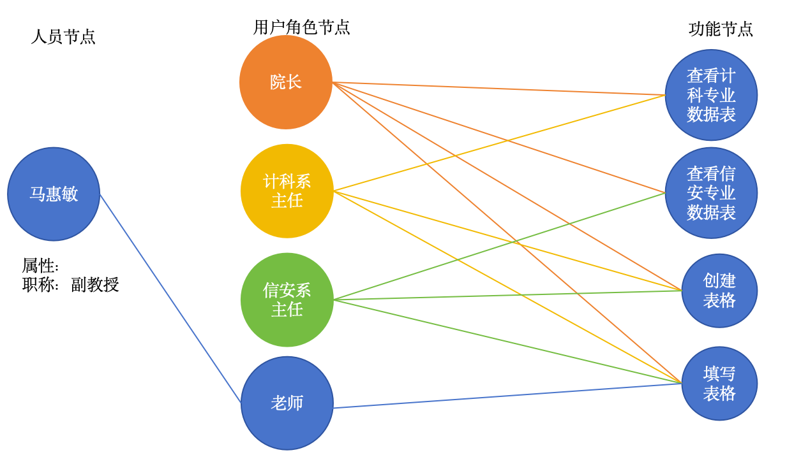

### 角色控制访问



```json
// 角色控制访问表
{
  "labels": [
    "roleControl"
  ],
  "properties": {
    name:'rc',
    dean: [1,2,3],
    chair:[1,2,3],
    teacher:[3]
  },
  "elementId": "78"
}
//1-查看表格
//2-创建表格
//3-填写表格
```
### 创建语句
```Cypher
create (n:roleControl{name:'rc',dean:[1,2,3],chair:[1,2,3],teacher:[3]}) 
```g